# System zarządzania serwisem elektroniki 

Projekt przedstawia system wspierający pełną obsługę procesu naprawy sprzętu elektronicznego — od przyjęcia urządzenia w recepcji, przez diagnozę i realizację naprawy, aż po kontrolę jakości, rozliczenie oraz wydanie sprzętu klientowi.

## Opis projektu

Aplikacja została zaprojektowana jako system do kompleksowego zarządzania serwisem elektroniki. Jej celem jest uporządkowanie pracy kilku działów oraz zapewnienie płynnego przepływu informacji pomiędzy pracownikami.

System obejmuje kilka głównych obszarów działania:

- **Panel recepcji** — rejestruje nowe zlecenia, wprowadza dane klienta i urządzenia, przedstawia kosztorys oraz obsługuje akceptację lub odrzucenie naprawy przez klienta.
- **Panel administratora** — służy do nadzoru nad przebiegiem napraw, kontroli jakości oraz analizy aktualnego stanu serwisu. Ma możliwość edytowania pracowników oraz klientów
- **Panel technika** — umożliwia technikowi przegląd własnych zadań, rozpoczęcie naprawy, wstrzymanie pracy w przypadku braku części oraz oznaczanie urządzenia jako gotowego do kontroli.
- **Panel magazynu** — odpowiada za zarządzanie częściami, realizację zapotrzebowań techników oraz prowadzenie listy zakupów.

## Główne funkcjonalności

### Zarządzanie zleceniami

- Rejestracja i ewidencja napraw.
- Przypisywanie zleceń do techników.
- Śledzenie aktualnego statusu urządzenia.
- Obsługa przepływu zlecenia pomiędzy recepcją, technikiem, administratorem i magazynem.

Przykładowe statusy zleceń:

- W kolejce
- W naprawie
- Czeka na części
- Do kontroli
- Gotowy
- Do wydania
- Wydany
- Poprawka (priorytet)

### Baza klientów i urządzeń

System wykorzystuje relacyjną bazę danych do przechowywania informacji o:

- klientach,
- urządzeniach,
- numerach seryjnych,
- historii wcześniejszych napraw.

Dzięki temu możliwe jest szybkie sprawdzenie, czy dane urządzenie było już wcześniej serwisowane.

### Moduł powiadomień

Aplikacja zawiera moduł komunikacji w czasie rzeczywistym oparty na socketach. Pozwala on informować pracowników o:

- nowych zleceniach,
- zmianie statusu naprawy,
- zapotrzebowaniu na części,
- konieczności podjęcia dalszej akcji.

## Struktura aplikacji

### 1. Panel logowania

<p align="center">
  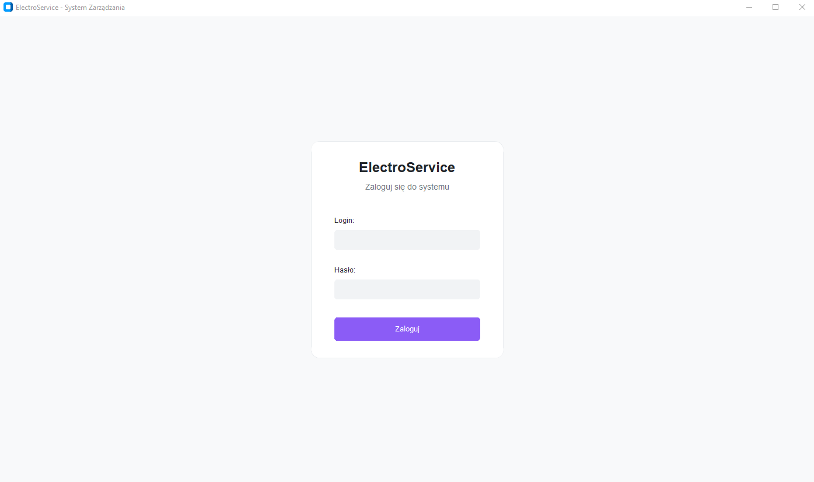
</p>

Panel logowania odpowiada za uwierzytelnianie użytkownika i przydzielenie dostępu zgodnie z jego rolą w systemie.

### 2. Panel recepcji

<p align="center">
  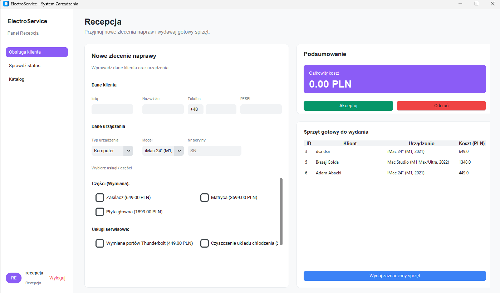
</p>

Panel recepcji odpowiada za przyjmowanie nowych zleceń oraz kontakt z klientem.

Zakres działań recepcji:

- wprowadzanie danych klienta,
- dodawanie danych urządzenia,
- określenie rodzaju zlecenia,
- wybór części i usług,
- prezentacja podsumowania kosztów,
- zapis decyzji klienta o akceptacji lub odrzuceniu naprawy,
- wydanie gotowego urządzenia.
- sprawdzanie statusu zlecenia.

W formularzach zastosowano walidację danych, między innymi:

- numer telefonu powinien zawierać dokładnie 9 cyfr,
- pola z danymi kontaktowymi nie powinny zawierać cyfr w nazwach i imionach.

<p align="center">
  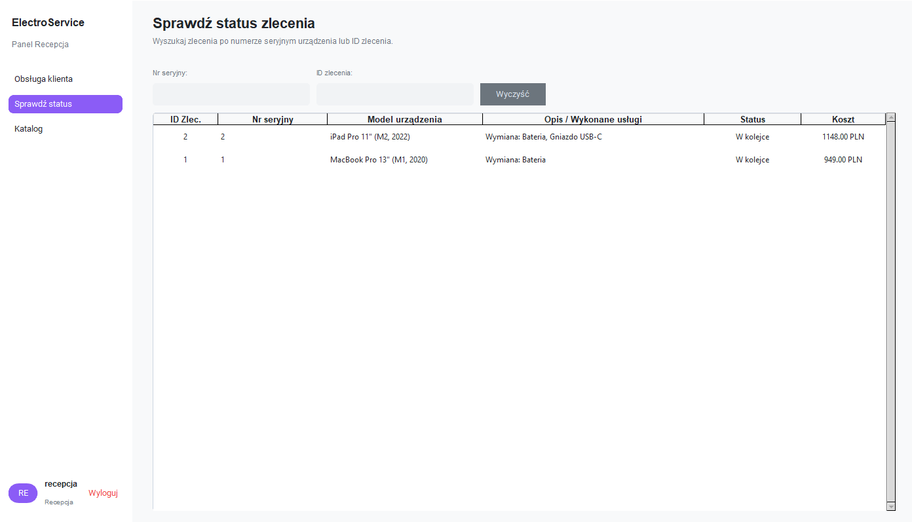
</p>

Ta zakładka służy do sprawdzania aktualnego statusu zlecenia klienta.

<p align="center">
  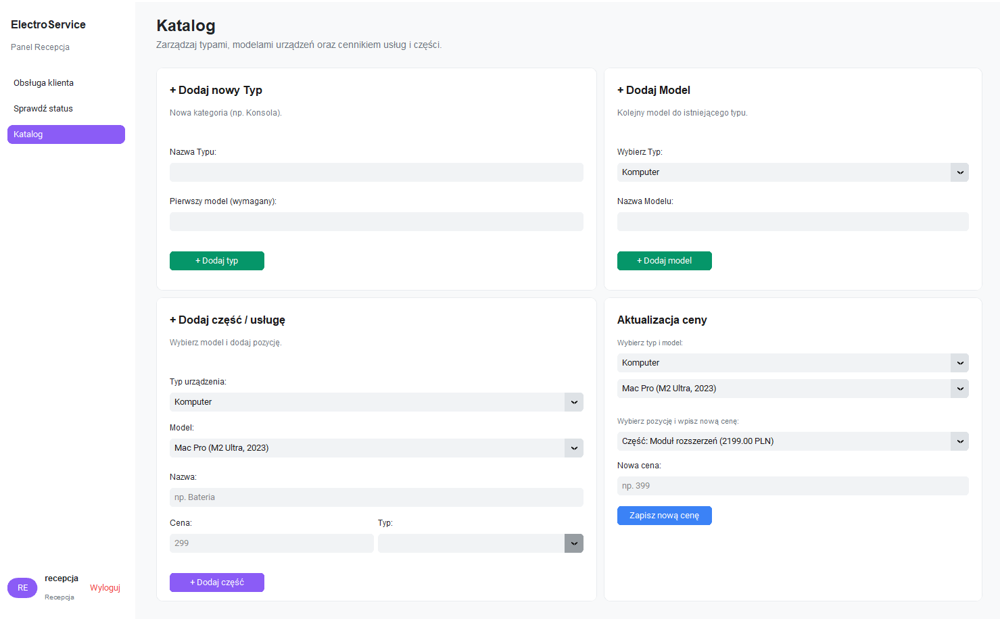
</p>

Katalog umożliwia dodawanie nowych typów, modeli oraz części dla urządzeń.

### 3. Panel administratora

<p align="center">
  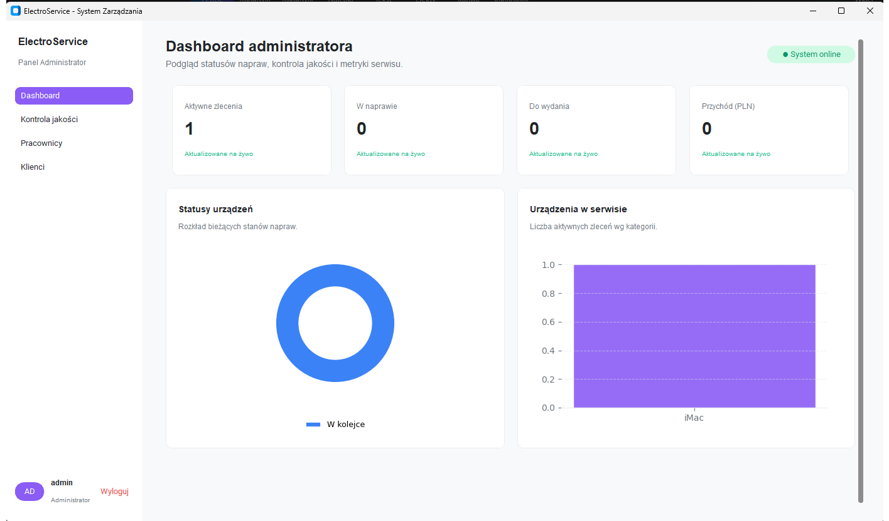
</p>

Panel administratora umożliwia nadzór nad pracą serwisu oraz szybką analizę bieżącej sytuacji.

W dashboardzie znajdują się między innymi:

- **Aktywne zlecenia** — wszystkie urządzenia, które nadal znajdują się w serwisie i nie mają statusu „wydany”.
- **W naprawie** — urządzenia aktualnie obsługiwane przez techników.
- **Do wydania** — urządzenia gotowe do odbioru przez klienta.
- **Przychód** — wartość naliczana po zakończeniu i wydaniu zlecenia.

Administrator widzi również wykres kołowy przedstawiający liczbę urządzeń w wybranych statusach, takich jak:

- W kolejce
- Do kontroli
- W naprawie
- Czeka na części
- Poprawka (priorytet)

Dodatkowo w systemie znajduje się sekcja akceptacji napraw. Administrator może:

- zaakceptować naprawę i przekazać urządzenie do recepcji w celu wydania,
- odrzucić naprawę i odesłać sprzęt do technika do poprawy.

<p align="center">
  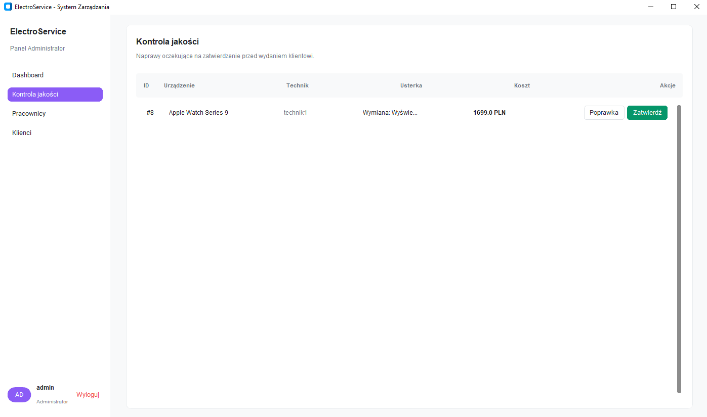
</p>

Admin posiada również uprawnienia dotyczące edycji danych:
- pracowników (login, hasło oraz przypisane role),

<p align="center">
  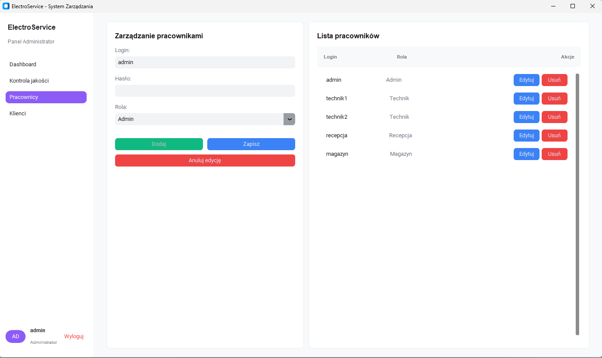
</p>

- klientów (imię, nazwisko, status zlecenia i telefon).

<p align="center">
  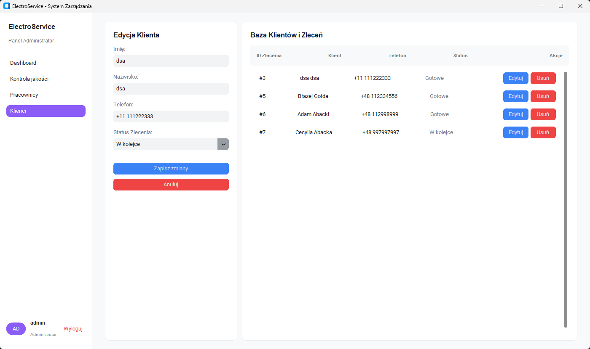
</p>

### 4. Panel technika

<p align="center">
  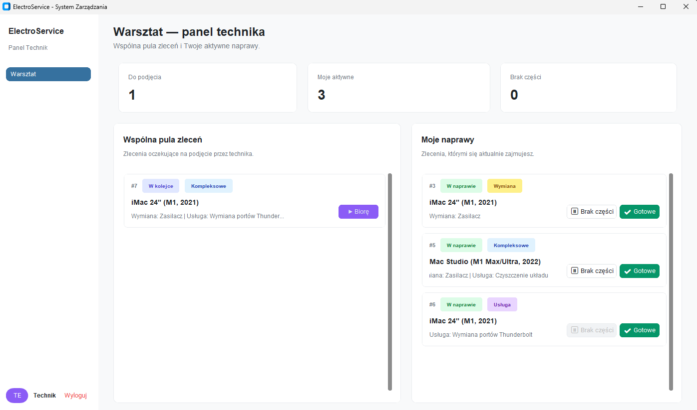
</p>

Panel technika stanowi główne miejsce pracy serwisanta. Technik ma dostęp wyłącznie do swoich zleceń.

Dostępne sekcje:

- **Do podjęcia** — nowe zlecenia przekazane do realizacji.
- **Moje aktywne** — naprawy aktualnie prowadzone przez technika.
- **Brak części** — zlecenia wstrzymane do momentu dostarczenia brakujących elementów.

Rodzaje tagów przypisywanych do zleceń:

- **Kompleksowe** — zlecenie obejmuje zarówno wymianę części, jak i usługę serwisową.
- **Wymiana** — zlecenie dotyczy wyłącznie wymiany części.
- **Usługa** — zlecenie obejmuje wyłącznie usługę serwisową.

### 5. Panel magazynu

<p align="center">
  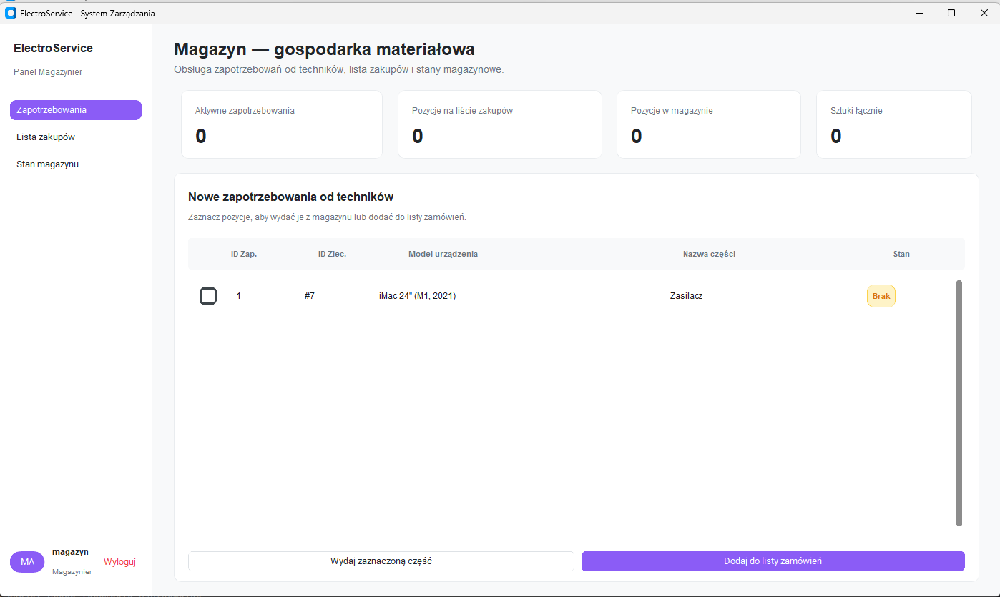
</p>

Panel magazynu pozwala kontrolować stan części i obsługiwać zapotrzebowania zgłaszane przez techników.

Główne sekcje magazynu:

- **Aktywne zapotrzebowania** — lista części wymaganych do realizacji bieżących napraw.
- **Pozycje na liście zakupów** — elementy niedostępne na stanie, które należy zamówić.
- **Stan magazynu** — lista części dostępnych do natychmiastowego wydania.

System umożliwia również ręczne dodawanie zapotrzebowania na produkty, które nie są jeszcze powiązane z konkretnym zleceniem.

<p align="center">
  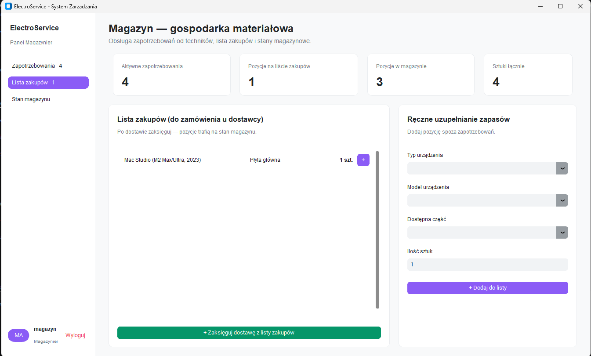
</p>


<p align="center">
  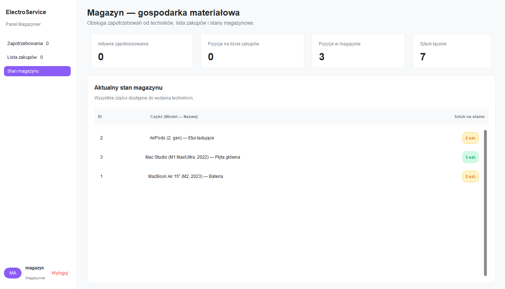
</p>

## Przepływ działania systemu

1. Recepcja przyjmuje urządzenie i zakłada nowe zlecenie.
2. Technik podejmuje zlecenie i rozpoczyna diagnozę lub naprawę.
3. Jeśli brakuje części, tworzone jest zapotrzebowanie do magazynu.
4. Magazyn wydaje część lub dodaje ją do listy zakupów.
5. Po zakończeniu pracy technik przekazuje urządzenie do kontroli jakości.
6. Administrator akceptuje naprawę lub odsyła ją do poprawy.
7. Recepcja wydaje urządzenie klientowi i finalizuje zlecenie.

## Baza danych

### Diagram ERD

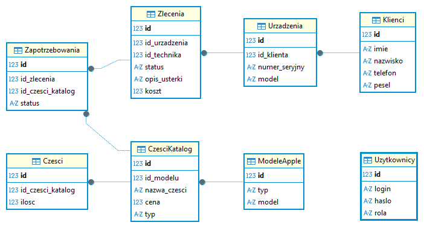

Diagram ERD przedstawia relacje pomiędzy najważniejszymi encjami systemu, takimi jak klienci, urządzenia, zlecenia, części oraz użytkownicy.

### Opis tabel

- **Zlecenia** — przechowują informacje o procesie naprawy, opisie usterki, statusie, przypisanym techniku i końcowym koszcie.
- **Urządzenia** — zawierają dane o sprzęcie klienta, modelu i numerze seryjnym.
- **Klienci** — przechowują dane kontaktowe klientów serwisu.
- **Zapotrzebowania** — łączą zlecenia z częściami potrzebnymi do realizacji naprawy.
- **CzesciKatalog** — katalog wszystkich dostępnych części wraz z cenami i przypisaniem do modeli.
- **Czesci** — odzwierciedlają aktualny stan magazynowy poszczególnych części.
- **ModeleApple** — słownik ujednolicający nazewnictwo modeli urządzeń.
- **Uzytkownicy** — tabela użytkowników systemu wraz z rolami i danymi logowania.

## Wykorzystane biblioteki

W projekcie wykorzystano następujące biblioteki i moduły:

- `CustomTkinter`
- `Matplotlib`
- `socket`
- `threading`
- `SQLite3`
- `NumPy`

## Instrukcja uruchomienia

### Wymagania wstępne
- Zainstalowany Python w wersji 3.10 lub nowszej.

### Kroki instalacji
Schemat uruchomienia aplikacji:

1. Utworzyć środowisko wirtualne:
   ```bash
   python -m venv venv
   ```
2. Aktywować środowisko:
   - Windows:
   ```bash
   venv\Scripts\activate
   ```
   - Linux/macOS:
   ```bash
   source venv/bin/activate
   ```
3. Zainstalować wymagane biblioteki:
   ```bash
   pip install -r requirements.txt
   ```
4. Jeśli baza danych jeszcze nie istnieje, zainicjalizować ją poleceniem:
   ```bash
   python init_db.py
   ```
5. Uruchomić serwer (obsługa połączeń gniazdowych):
   ```bash
   python serwer.py
   ```
6. W nowym terminalu ponownie aktywować środowisko i uruchomić aplikację:
   ```bash
   python main.py
   ```

### Konta testowe

| Login       | Hasło      | Stanowisko |
|-------------|------------|------------|
| `admin`     | `admin123` | Admin      |
| `technik1`  | `tech123`  | Technik    |
| `technik2`  | `tech123`  | Technik    |
| `recepcja`  | `rec123`   | Recepcja   |
| `magazyn`   | `mag123`   | Magazyn    |
